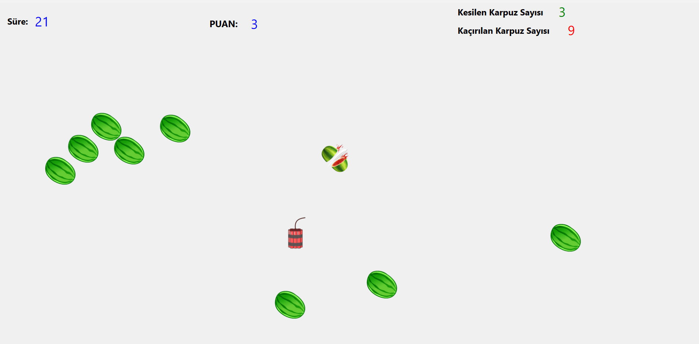

# Watermelon-Cutting-Game-with-QT
When the game starts, watermelons (and bombs) appear on the screen and begin falling. Cutting the watermelon earns points, while detonating the bomb costs points. When the timer runs out, the score is calculated and recorded.

# An Image from the Game

